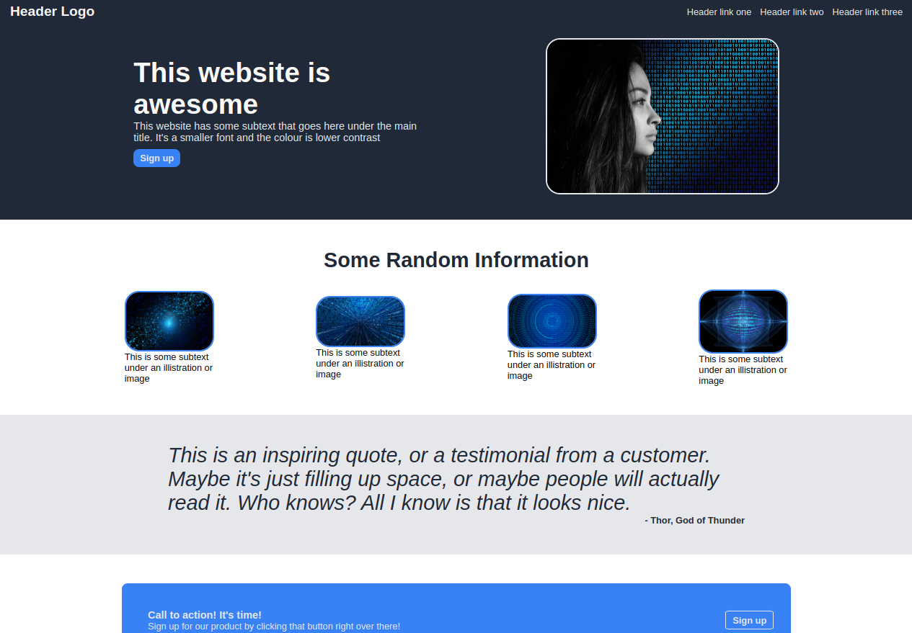

# Awesome Landing Page



## Summary

**Hosted:** [Awesome Landing Page](https://blurryq.github.io/landing-page/)

This project is my attempt at recreating Odin's awesome landing page. It’s a fundamental exercise in mastering layouts, with a strong focus on flexbox for responsive, organized content. This layout serves as the bread and butter of web design, giving me hands-on experience in structuring a modern hero bar layout with engaging, well-spaced content.

## Features

This website showcases my new knowledge in HTML and CSS, particularly with the use of flex layout to create a clean, responsive design. The layout includes several key sections:

**Header**: A modern header with a logo and navigation links that are flex-aligned, making it easy to adapt for different screen sizes.
**Hero Section**: A prominent headline with subtext, paired with a call-to-action button and image placeholder. Flex layout is used to arrange the elements, keeping them well-balanced and visually engaging.
**Information Section**: Displays an informational header and a row of image-text pairs. Each image has a bordered, rounded style, with flexbox ensuring a consistent and responsive arrangement.
**Quote/Testimonial Section**: Includes a large, centered quote and attribution text. Flex layout supports vertical alignment, making the quote the focal point of this section.
**Call-to-Action Section**: A strong, centered call-to-action message, styled with flex for even spacing and alignment, leading to a final "Sign Up" button.
**Footer**: A simple, centered footer styled to match the header.

## Setup

To get started with this project, follow the steps below:

### 1. Fork the Repository

First, you need to fork this repository to your GitHub account by clicking the "Fork" button near the top right of this page. If you are unfamiliar with this process, please follow this GitHub [guide](https://docs.github.com/en/pull-requests/collaborating-with-pull-requests/working-with-forks/fork-a-repo).

### 2. Clone the Repository

Next, clone the repository to your local machine using the following command. Make sure to replace `your-username` with your GitHub username:

```
git clone https://github.com/your-username/landing-page
```

### 3. Running the File

Once cloned, navigate to your project folder, locate the HTML file, and double-click it. This should open the file in your default browser.

Alternatively, if you're using Visual Studio Code, you can install the "Live Server" extension and use it to launch the project by right-clicking on the HTML file and selecting **Open with Live Server**.

### 4. Have Fun